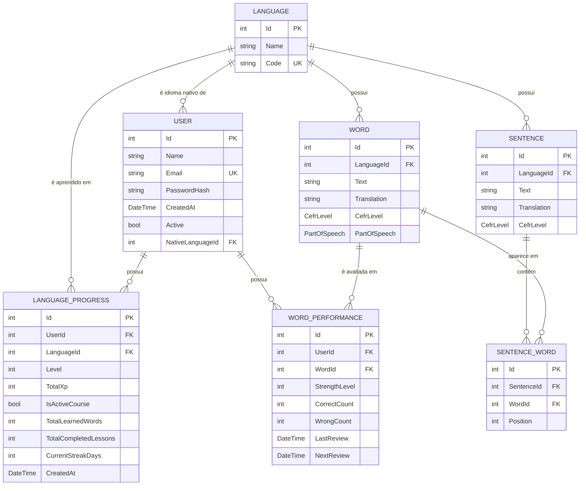

# Modelo de domínio — MemoLingo

Diagrama das entidades existentes hoje em `MemoLingo.Domain/Entities` e seus relacionamentos.

## Observações

- `User.NativeLanguageId` → `Language` com `DeleteBehavior.Restrict`.
- `LanguageProgress` é a entidade de associação entre `User` e `Language` (índice único em `UserId` + `LanguageId`); exclusão em cascata a partir de `User` e restrita a partir de `Language`.
- `Word` pertence a um `Language` por meio da propriedade de navegação `Language` e possui nível CEFR (`CefrLevel`) e categoria gramatical (`PartOfSpeech`).
- `Sentence` pertence a um `Language` e associa-se a `Word` por meio da entidade de junção `SentenceWord` (com `Position` indicando a ordem da palavra na frase).
- `WordPerformance` referencia `User` e `Word` por navegação e registra acertos (`CorrectCount`), erros (`WrongCount`), a última revisão (`LastReview`, nula enquanto a palavra não for revisada) e a próxima revisão (`NextReview`).
- Apenas `User`, `Language` e `LanguageProgress` estão mapeados como `DbSet` em `AppDbContext`; `Word`, `Sentence`, `SentenceWord` e `WordPerformance` ainda não foram incluídos no contexto nem nas migrations.
