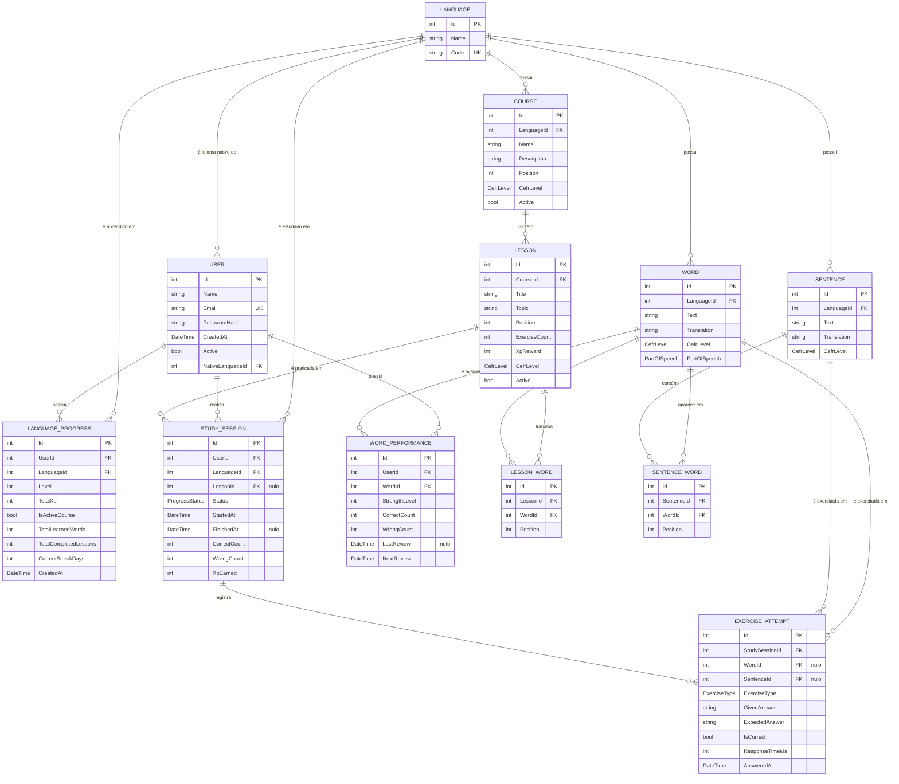

# Modelo de domínio — MemoLingo

Diagrama das entidades existentes hoje em `MemoLingo.Domain/Entities` e seus relacionamentos.

## Enums

- `CefrLevel`: `A1`, `A2`, `B1`, `B2`, `C1`, `C2`.
- `PartOfSpeech`: `Noun`, `Verb`, `Adjective`, `Adverb`, `Pronoun`, `Preposition`, `Conjunction`, `Interjection`, `Article`, `Numeral`, `Expression`.
- `ExerciseType`: `MultipleChoice`, `FreeTranslation`, `FillInTheBlank`, `ListenAndWrite`, `Speaking`, `WordOrdering`.
- `ProgressStatus`: `Locked`, `Available`, `InProgress`, `Completed`, `Abandoned`.

## Observações

- `User.NativeLanguageId` → `Language` com `DeleteBehavior.Restrict`.
- `LanguageProgress` é a entidade de associação entre `User` e `Language` (índice único em `UserId` + `LanguageId`); exclusão em cascata a partir de `User` e restrita a partir de `Language`.
- `Word` pertence a um `Language` por meio da propriedade de navegação `Language` e possui nível CEFR (`CefrLevel`) e categoria gramatical (`PartOfSpeech`).
- `Sentence` pertence a um `Language` e associa-se a `Word` por meio da entidade de junção `SentenceWord` (com `Position` indicando a ordem da palavra na frase).
- `Course` agrupa uma trilha de um `Language`, ordenada por `Position`, e possui várias `Lesson` (exclusão em cascata a partir de `Course`).
- `Lesson` associa-se a `Word` por meio da entidade de junção `LessonWord` (índice único em `LessonId` + `WordId`).
- `StudySession` representa uma prática do usuário em um idioma, opcionalmente vinculada a uma `Lesson` (`LessonId` nulo, com `DeleteBehavior.SetNull`), e acumula `CorrectCount`, `WrongCount` e `XpEarned`.
- `ExerciseAttempt` pertence a uma `StudySession` (exclusão em cascata) e referencia opcionalmente `Word` ou `Sentence`, conforme o `ExerciseType`.
- `WordPerformance` referencia `User` e `Word` por navegação e registra acertos (`CorrectCount`), erros (`WrongCount`), a última revisão (`LastReview`, nula enquanto a palavra não for revisada) e a próxima revisão (`NextReview`).
- Todas as entidades estão mapeadas como `DbSet` em `AppDbContext`: `Users`, `Languages`, `LanguageProgresses`, `Words`, `Sentences`, `SentenceWords`, `Courses`, `Lessons`, `LessonWords`, `StudySessions`, `ExerciseAttempts` e `WordPerformances`.
